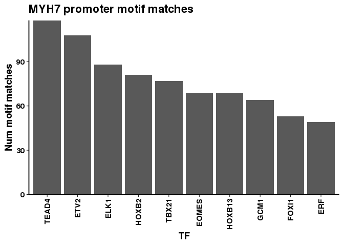

Retrieve MYH7 promoter motif matches from Ensembl
-------------------------------------------------

The Ensembl Regulatory Build seems to be one of the easiest / best resources for matched motifs in the human genome. I beleive that they also have information on bound proteins from ChIP-seq tracks -- which is awesome. Here we aim to do an analysis of the MYH7 promoter region to see which TFs could be linking MYH7b expression levels to MYH7 mRNA expression.

``` r
# Retrieve motif matches for MYH7
# Let's use the annotation we've been using
gtf <- rtracklayer::import("../../util/gencode.v33.annotation.gtf")
genes <- gtf[which(gtf$type == "gene")]

myh7 <- genes[which(genes$gene_name == "MYH7")]
myh7_promoter <- promoters(myh7, upstream = 3e3, downstream = 3e3)
```

So we'll just grab the promoter region +/-3kb for MYH7B from the motif feature Ensembl track using the biomart webservice.

``` bash
cd data
wget -O result.txt 'http://www.ensembl.org/biomart/martservice?query=<?xml version="1.0" encoding="UTF-8"?> 
<!DOCTYPE Query>
<Query  virtualSchemaName = "default" formatter = "TSV" header = "0" uniqueRows = "0" count = "" datasetConfigVersion = "0.6" >
            
    <Dataset name = "hsapiens_motif_feature" interface = "default" >
        <Filter name = "chromosome_name" value = "14"/>
        <Filter name = "start" value = "23432661"/>
        <Filter name = "end" value = "23438660"/>
        <Attribute name = "binding_matrix_id" />
        <Attribute name = "chromosome_name" />
        <Attribute name = "chromosome_start" />
        <Attribute name = "chromosome_end" />
        <Attribute name = "score" />
        <Attribute name = "feature_type_name" />
        <Attribute name = "display_label" />
    </Dataset>
</Query>'
```

    ## --2020-05-28 11:10:37--  http://www.ensembl.org/biomart/martservice?query=%3C?xml%20version=%221.0%22%20encoding=%22UTF-8%22?%3E%20%0A%3C!DOCTYPE%20Query%3E%0A%3CQuery%20%20virtualSchemaName%20=%20%22default%22%20formatter%20=%20%22TSV%22%20header%20=%20%220%22%20uniqueRows%20=%20%220%22%20count%20=%20%22%22%20datasetConfigVersion%20=%20%220.6%22%20%3E%0A%09%09%09%0A%09%3CDataset%20name%20=%20%22hsapiens_motif_feature%22%20interface%20=%20%22default%22%20%3E%0A%09%09%3CFilter%20name%20=%20%22chromosome_name%22%20value%20=%20%2214%22/%3E%0A%09%09%3CFilter%20name%20=%20%22start%22%20value%20=%20%2223432661%22/%3E%0A%09%09%3CFilter%20name%20=%20%22end%22%20value%20=%20%2223438660%22/%3E%0A%09%09%3CAttribute%20name%20=%20%22binding_matrix_id%22%20/%3E%0A%09%09%3CAttribute%20name%20=%20%22chromosome_name%22%20/%3E%0A%09%09%3CAttribute%20name%20=%20%22chromosome_start%22%20/%3E%0A%09%09%3CAttribute%20name%20=%20%22chromosome_end%22%20/%3E%0A%09%09%3CAttribute%20name%20=%20%22score%22%20/%3E%0A%09%09%3CAttribute%20name%20=%20%22feature_type_name%22%20/%3E%0A%09%09%3CAttribute%20name%20=%20%22display_label%22%20/%3E%0A%09%3C/Dataset%3E%0A%3C/Query%3E
    ## Resolving www.ensembl.org (www.ensembl.org)... 193.62.193.83
    ## Connecting to www.ensembl.org (www.ensembl.org)|193.62.193.83|:80... connected.
    ## HTTP request sent, awaiting response... 200 OK
    ## Length: unspecified [text/plain]
    ## Saving to: ‘result.txt’
    ## 
    ##      0K .......... .......... .......... .......... .......... 63.4K
    ##     50K .......... .......... .......... .......... .......... 68.4K
    ##    100K .......... .......... .                                39.7K=2.1s
    ## 
    ## 2020-05-28 11:10:40 (58.9 KB/s) - ‘result.txt’ saved [124523]

What does the double colon mean in the ensembl regulatory build?

I’m going to assume for now that the two TFs separated by double colons means that the TFs both have a motif that corresponds to the match rather than that they need to be jointly bound.

``` r
binding_sites <- read.table("data/result.txt",
                            col.names = c("motif_id",
                                          "chr",
                                          "start",
                                          "end", 
                                          "score",
                                          "tf_name",
                                          "match_id"))

# Split the motifs that correspond to two transcription factors.
binding_sites <- binding_sites %>% 
  separate_rows("tf_name", sep = "::")


binding_site_summary <- binding_sites %>% group_by(tf_name) %>%
  summarize(count = n()) %>%
  arrange(-count) %>%
  mutate(tf_name = factor(tf_name, levels = tf_name))
```

Let's make a plot of the top binding sites at the promoter.

``` r
g <- ggplot(binding_site_summary %>% dplyr::slice(1:10), aes(x = tf_name, y = count))
g + geom_bar(stat = "identity") + 
  theme_paperwhite() +
  scale_y_continuous(expand = c(0,0)) +
  theme(panel.border = element_blank(),
        axis.line = element_line(colour = "black")) + 
  xlab("TF") +
  ylab("Num motif matches") +
  ggtitle("MYH7B promoter motif matches")
```



``` r
ggsave("figures/myh7b_promoter_motif_matches.png")
```

    ## Saving 7 x 5 in image

``` r
ggsave("figures/myh7b_promoter_motif_matches.pdf")
```

    ## Saving 7 x 5 in image
